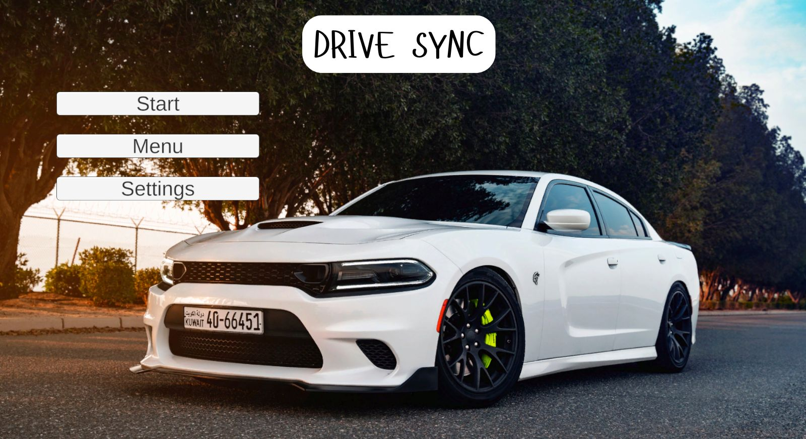

# DriveSync

## 🚀 Overview
**DriveSync** redefines racing game controls by replacing traditional input devices with **hand gesture recognition** powered by **real-time computer vision**. Built in **Unity** and leveraging **OpenCV**, **Mediapipe**, and **Python**, DriveSync allows you to steer, accelerate, and brake using intuitive hand movements.

---

## 🎮 Demo Video
▶️ [Watch DriveSync Gameplay Demo](https://drive.google.com/file/d/1S4uFdTO_Cd4LgsSncCQ1x9v_KFuJFR5T/preview)
[](Assets/Video/0411.mp4)  
*Click the image to view or download the gameplay demo video.*

---

## ✨ Features
- 🖐️ **Hand Gesture Controls**: Powered by Python and Mediapipe for accurate and responsive input.
- 🕹️ **Real-Time Steering**: Seamlessly integrated with Unity for a smooth gaming experience.
- 🔁 **Seamless Communication**: Utilizes UDP sockets for efficient data transfer between Python and Unity.
- 🎮 **Immersive, Controller-Free Gameplay**: Enjoy a fully immersive experience without traditional controllers.
- 🧠 **Skill Showcase**: Ideal for demonstrating expertise in computer vision and Unity development.

---

## 🔧 Setup & Execution

### Prerequisites
- **Python 3.x** installed
- **Unity Hub** and **Unity Editor** (version compatible with the project)
- A webcam for gesture detection

### Installation Steps
1. **Install Python Dependencies**  
   Install the required Python packages:
   ```bash
   pip install opencv-python mediapipe pydirectinput
   ```

2. **Enable UDP Communication**  
   DriveSync uses UDP sockets to transmit gesture data from Python to Unity. Ensure your network settings allow UDP communication (default port specified in scripts).

3. **Run the Gesture Recognition Script**  
   Execute the Python script to start gesture detection:  
   - Opens the webcam for real-time hand tracking.  
   - Detects gestures (left, right, open palm, closed fist).  
   - Sends control data to Unity via UDP.  
   ```bash
   python gesture_recognition.py
   ```

4. **Open the Unity Project**  
   - Launch Unity Hub and open the DriveSync project.  
   - Locate the `handgesture.cs` script in the Unity project.  
   - This script listens for UDP packets from Python and maps them to in-game controls.

5. **Play the Game**  
   - Press the Play button in the Unity Editor.  
   - Use hand gestures to control the car! ✋➡️🏎️

---

## 🧠 How It Works

### Architecture Flow
```
Webcam → Python (OpenCV + Mediapipe) → gesture_recognition.py
         ↓
       UDP Socket (Python → Unity)
         ↓
Unity → handgesture.cs → Car Control
```

- **`gesture_recognition.py`**: Captures webcam input, processes hand gestures using Mediapipe, and sends control signals over UDP.  
- **`handgesture.cs`**: Listens for UDP packets in Unity and translates them into car movements (steering, acceleration, braking).  
- **Result**: Fluid, controller-free car control using hand gestures.

---

## 📦 Tech Stack
- **Unity (C#)**: Game logic and rendering  
- **Python (OpenCV + Mediapipe)**: Real-time gesture detection  
- **UDP Sockets**: Data transmission between Python and Unity  
- **pydirectinput**: Optional keyboard emulation for testing  

---

## 🕹️ Gesture Mappings
| Hand Gesture | Action      |
|--------------|-------------|
| Hand Right   | Turn Right  |
| Hand Left    | Turn Left   |
| Open Palm    | Accelerate  |
| Closed Fist  | Brake       |

---

## 🚧 Future Enhancements
- 🎨 Customizable gestures through a user interface  
- 🌐 Online multiplayer support  
- 🔧 Improved gesture calibration and noise filtering  
- 🧠 Machine learning for advanced gesture recognition  
- 🕶️ Integration with AR headsets  

---

## 👥 Contributing
Contributions are welcome! To contribute:  
1. Fork the repository.  
2. Create a new branch for your feature or bug fix.  
3. Submit a pull request with a clear description of your changes.  

Please report bugs or suggest features via the [Issues](https://github.com/haveyoumetmiz/DriveSync/issues) page.

---

## 📄 License
This project is licensed under the [MIT License](LICENSE).

---

## 📬 Contact
- 📧 **Email**: [mizh48.ansar@gmail.com](mailto:mizh48.ansar@gmail.com)  
- 💼 **LinkedIn**: [Mizhab Ansar](https://www.linkedin.com/in/mizhab-ansar)  
- 🧑‍💻 **GitHub**: [haveyoumetmiz](https://github.com/haveyoumetmiz)  
- 📷 **Instagram**: [@haveyoumetmiz](https://www.instagram.com/haveyoumetmiz)  
